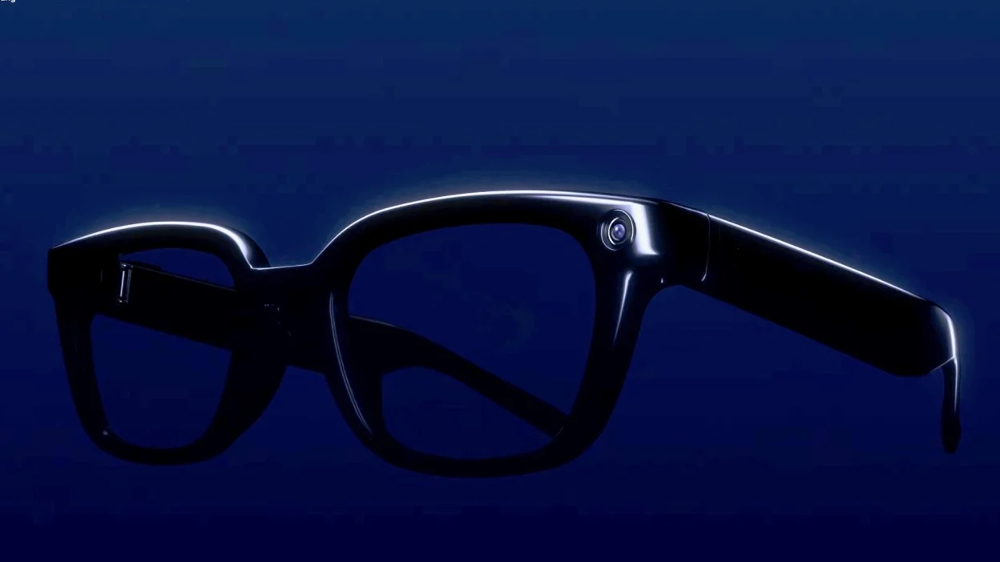

 

 

  

<i>Building scalable web applications and intelligent systems that solve real-world problems and create meaningful impact.</i>

  

&nbsp;

&nbsp;

  

---

<table>
<tr>
<td width="35%" align="center">

 

### FULL STACK DEVELOPER

MERN · Next.js · Cloud

### AI & AUTOMATION

Agent Workflows · LLMs

### HARDWARE + VISION

Raspberry Pi · Computer Vision

</td>

<td width="65%" valign="top">

## 👩🏻‍💻 About Me

I'm a **Full Stack Developer** specializing in the **MERN stack, Next.js, and cloud deployments**. I enjoy transforming complex ideas into scalable, high-performance web applications and intelligent systems powered by AI and automation.

- 🚀 Building production-ready **web applications and business platforms**
- 🤖 Exploring **AI agents and intelligent automation workflows**
- ☁️ Working with **cloud platforms, APIs, databases, and modern deployment workflows**
- 📟 Exploring the intersection of **software, hardware, and computer vision**
- 🎨 Passionate about creating **clean, responsive and engaging digital experiences**
- 🔧 Comfortable taking projects **from database design to deployed UI**
- 🌱 Continuously improving **system design, cloud architecture and modern development practices**

</td>
</tr>
</table>

---

# 🛠️ TECH ARSENAL

<table>
<tr>
<td width="50%" align="center">

### 🎨 FRONTEND

 

React · Next.js · JavaScript · TypeScript

</td>

<td width="50%" align="center">

### ⚙️ BACKEND & DATABASE

 

Node.js · Express · MongoDB · PostgreSQL · SQLite

</td>
</tr>

<tr>
<td width="50%" align="center">

### ☁️ CLOUD & SERVICES

 

 

AWS · Firebase · Supabase · Cloudinary

</td>

<td width="50%" align="center">

### 🛠️ DEVELOPMENT TOOLS

 

Python · Git · GitHub · VS Code · Figma

</td>
</tr>
</table>

---

# 🤖 AI / AUTOMATION STACK

---

# ⭐ FEATURED PROJECTS

A selection of projects combining full-stack development, AI, automation and modern digital experiences.

<table>
<tr>

<td width="33%" valign="top" align="center">

<h3>01 · JOJO RESORT</h3>

<b>Premium Resort Website</b>

A premium resort website focused on elegant UI, room presentation, gallery experience and modern booking interaction.

<code>Next.js</code>
<code>MongoDB</code>
 
<code>Tailwind CSS</code>
<code>Node.js</code>

  

</td>

<td width="33%" valign="top" align="center">

<h3>02 · B-SMART GLASS</h3>

<b>Aura Vision</b>

AI-powered assistive smart glass designed to support visually impaired users with navigation, object detection and voice assistance.

<code>MERN</code>
<code>OpenAI API</code>
 
<code>Raspberry Pi</code>
<code>WebRTC</code>

  

</td>

<td width="33%" valign="top" align="center">

<h3>03 · CINEMATIC PORTFOLIO</h3>

<b>Cinematic Animated Digital Experience</b>

An interactive developer portfolio featuring cinematic animations, smooth scrolling and modern UI interactions.

<code>Next.js</code>
<code>Framer Motion</code>
 
<code>Tailwind CSS</code>

  

</td>

</tr>
</table>

---

<table>
<tr>

<td width="50%" align="center">

### 🏅 STATE LEVEL SELECTED

My project was selected at the **State Level** in a technical competition.

</td>

<td width="50%" align="center">

### 🚀 TOP PERFORMER

Recognized as a **Top Performer** for exceptional performance and contribution.

</td>

</tr>
</table>

---

# 💻 DEVELOPMENT FOCUS

### Building · Integrating · Automating · Deploying

**FULL STACK DEVELOPMENT**  
MERN · Next.js · Node.js · Databases

**AI & AUTOMATION**  
Gemini · OpenAI · n8n · Make.com

**CLOUD & INFRASTRUCTURE**  
AWS · Firebase · Supabase · Cloudinary

**HARDWARE & VISION**  
Raspberry Pi · Computer Vision

---

# 🌐 LET'S CONNECT

### Let's build something impactful together.

&nbsp;

&nbsp;

&nbsp;

  

<b>Code with purpose. · Build with passion. · Automate the future.</b>

